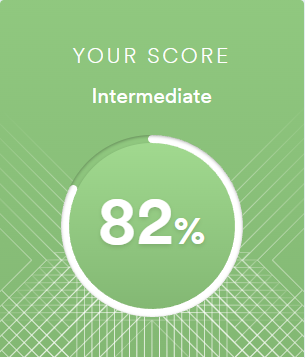

# Gavrilenko Egor
## Contacts information:
* Discord: Bambloo#5673
* Telegram: https://t.me/Bambloo
* Email: gavrilenkoivt@gmail.com
## About myself:
I came to the courses to gain new knowledge and close the gaps in education. I hope to make many interesting acquaintances and participate in team development of applications.
## Skills:
* HTML5
* CSS3
* JavaScript
* Git
* Jest
* Python (basics)
* NodeJs (a bit)
## Code example:
The university had a task to calculate the phase of the oscillatory unit
```python
import numpy as np
from matplotlib import pyplot as plt
%matplotlib inline

tick = 8
numberOfDecade = 6
x = np.geomspace(0.001, 100, num=(tick + (tick-1)*(numberOfDecade-2)))

T = 2
eps = 0.5
koleb = np.empty(shape=(1, len(x)))
koleb = [-np.arctan((2 * T * eps * val)/(1 - T**2 * val**2))  * 180 / np.pi if val <= 1/T else (-np.pi - np.arctan((2 * T * eps * val)/(1 - T**2 * val**2)))  * 180 / np.pi for val in x]
koleb = np.asarray(koleb)

plt.plot(x, koleb)
plt.xscale('log')
plt.axis('tight')
plt.show()
```

https://www.codewars.com/kata/5390bac347d09b7da40006f6
```javascript
String.prototype.toJadenCase = function () {
  return this.split(' ').map((item) => item.charAt(0).toUpperCase() + item.slice(1)).join(' ');
};
```
## Languages:
* Russian: native
* English: intermediate (https://www.efset.org/)

 
